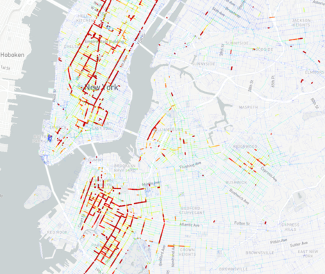

<!-- README.md is generated from README.Rmd. Please edit that file -->

[](https://travis-ci.org/moveability/calibration)
[](http://www.repostatus.org/#concept)

calibration
===========

<!-- badges: start -->

[](https://travis-ci.org/moveability/calibration)
<!-- badges: end -->

Calibration of [moveability](https://github.com/moveability/moveability)
model of pedestrian flows against empirical [pedestrian counts for New
York
City](https://www1.nyc.gov/html/dot/html/about/datafeeds.shtml#Pedestrians).

Final result looks like this:

    #> Loading calibration

``` r
x <- calc_layer_scales (data_dir, model = "final")
#> ❯ Extracting final layers from full network:
  |======================================================================| 100%
#> ✔ Extracted final layers from full network
knitr::kable (x)
```

|     | layer   |      estimates|   full\_rel|    ped\_rel|     full\_abs|      ped\_abs|          t|          p|
|-----|:--------|--------------:|-----------:|-----------:|-------------:|-------------:|----------:|----------:|
| 13  | hea-dis |  105658.191105|   0.5719363|   0.3459949|  60429.755766|  36557.196583|   9.868915|  0.0000000|
| 1   | sub-dis |      22.566344|   0.5219142|   0.5682277|     11.777695|     12.822822|   8.986039|  0.0000000|
| 12  | sub-cen |     -10.087818|  -0.2347841|  -0.3304276|      2.368459|      3.333293|  -6.994975|  0.0000000|
| 6   | sub-hea |       8.378134|   0.4338598|   0.4335501|      3.634935|      3.632341|   6.658314|  0.0000000|
| 7   | sus-edu |   -5923.748211|  -0.6416411|  -0.5697332|   3800.920378|   3374.956231|  -6.056855|  0.0000000|
| 8   | edu-hea |  -24921.480025|  -0.4563520|  -0.3789464|  11372.966534|   9443.905594|  -5.607032|  0.0000002|
| 4   | edu-tra |   23977.299359|   0.3225789|   0.2620421|   7734.569685|   6283.060961|   5.347316|  0.0000006|
| 2   | sub-tra |       6.444493|   0.2392262|   0.2839541|      1.541692|      1.829940|   5.080766|  0.0000018|
| 9   | sus-res |    6258.235319|   0.3904308|   0.4362252|   2443.407704|   2729.999677|   5.080036|  0.0000018|
| 11  | sus-sub |   -1336.884757|  -0.1903741|  -0.2170844|    254.508256|    290.216796|  -4.039428|  0.0001066|
| 5   | sus-ent |    1445.795365|   0.2070682|   0.1704797|    299.378267|    246.478763|   4.002238|  0.0001220|
| 3   | edu-dis |  -78056.981732|  -0.5872607|  -0.3261469|  45839.794420|  25458.042278|  -3.183290|  0.0019518|
| 14  | ent-tra |   38179.006598|   0.1893925|   0.1540936|   7230.818735|   5883.141715|   3.176518|  0.0019936|
| 10  | edu-sus |   16903.889029|   0.2340051|   0.1677712|   3955.596308|   2835.985535|   3.033825|  0.0030914|

With the following model statistics:

``` r
dat <- readRDS (file.path (data_dir, "ped-model-final.Rds"))
f_ <- dat$flowvars
summary (lm (dat$p ~ f_))
#> 
#> Call:
#> lm(formula = dat$p ~ f_)
#> 
#> Residuals:
#>     Min      1Q  Median      3Q     Max 
#> -4555.9  -964.8   -93.6   921.1  3595.5 
#> 
#> Coefficients:
#>               Estimate Std. Error t value Pr(>|t|)    
#> (Intercept)    -13.636    428.039  -0.032 0.974650    
#> f_sub-dis       22.566      2.511   8.986 1.92e-14 ***
#> f_sub-tra        6.444      1.268   5.081 1.80e-06 ***
#> f_edu-dis   -78056.982  24520.851  -3.183 0.001952 ** 
#> f_edu-tra    23977.299   4483.987   5.347 5.84e-07 ***
#> f_sus-ent     1445.795    361.247   4.002 0.000122 ***
#> f_sub-hea        8.378      1.258   6.658 1.61e-09 ***
#> f_sus-edu    -5923.748    978.024  -6.057 2.57e-08 ***
#> f_edu-hea   -24921.480   4444.683  -5.607 1.90e-07 ***
#> f_sus-res     6258.235   1231.927   5.080 1.80e-06 ***
#> f_edu-sus    16903.889   5571.808   3.034 0.003091 ** 
#> f_sus-sub    -1336.885    330.959  -4.039 0.000107 ***
#> f_sub-cen      -10.088      1.442  -6.995 3.29e-10 ***
#> f_hea-dis   105658.191  10706.161   9.869 2.33e-16 ***
#> f_ent-tra    38179.007  12019.137   3.177 0.001994 ** 
#> ---
#> Signif. codes:  0 '***' 0.001 '**' 0.01 '*' 0.05 '.' 0.1 ' ' 1
#> 
#> Residual standard error: 1566 on 98 degrees of freedom
#> Multiple R-squared:  0.8594, Adjusted R-squared:  0.8393 
#> F-statistic: 42.77 on 14 and 98 DF,  p-value: < 2.2e-16
```

The final flow model looks like this:


