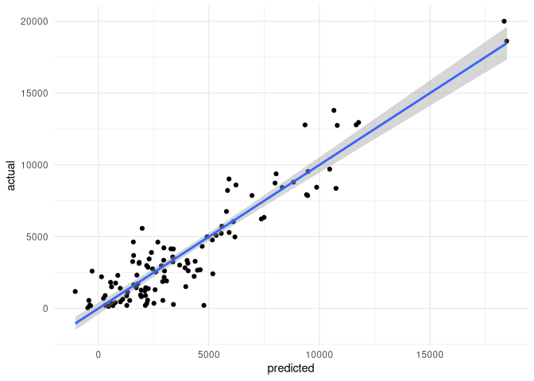

<!-- README.md is generated from README.Rmd. Please edit that file -->

[](https://travis-ci.org/ATFutures/nyped)
[](http://www.repostatus.org/#concept)

# nyped

    #> 
    #> Attaching package: 'testthat'
    #> The following object is masked from 'package:dplyr':
    #> 
    #>     matches

Model of pedestrian flows against empirical [pedestrian counts for New
York
City](https://www1.nyc.gov/html/dot/html/about/datafeeds.shtml#Pedestrians),
constructed from “flow layers” formed from pair-wise matching between
the following seven categories of origins and destinations:

1.  subway
2.  residential
3.  transportation
4.  sustenance
5.  entertainment
6.  education
7.  healthcare

An eighth category is network centrality, with additional layers
modelling dispersal from each of these categories. The model explains
R<sup>2</sup>= 83.9 of the observed variation in pedestrian counts.
Final result looks like this:

``` r
dat <- readRDS (file.path (data_dir, "ped-model-final.Rds"))
f_ <- dat$flowvars
mod <- summary (lm (dat$p ~ f_))
coeffs <- data.frame (mod$coefficients [2:nrow (mod$coefficients), ])
# for some reason, colnames do not transfer properly:
names (coeffs) <- colnames (mod$coefficients)
coeffs <- cbind ("Layer Name" = gsub ("f_", "", rownames (coeffs)),
                 coeffs)
# Next line is critical, because the vertical lines are interpreted by markdown
# as table column breaks, which mucks the whole thing up!
names (coeffs) [length (names (coeffs))] <- "Pr(>t)"
# order by origin, then by decreasing absolute T value
coeffs$origin <- substr (coeffs$`Layer Name`, 1, 3)
names (coeffs) [which (names (coeffs) == "t value")] <- "t"
coeffs <- arrange (coeffs, origin, desc (t))
rownames (coeffs) <- NULL
coeffs$origin <- NULL
names (coeffs) [which (names (coeffs) == "t")] <- "t value"
knitr::kable (coeffs, digits = c (NA, 0, 0, 2, 4), row.names = FALSE, caption = "Table 1. Statistical parameters of final model of pedestrian flows through New York City. (Placeholder only in rendered version)")
```

| Layer Name | Estimate | Std. Error | t value | Pr(\>t) |
| :--------- | -------: | ---------: | ------: | ------: |
| edu-tra    |    23977 |       4484 |    5.35 |  0.0000 |
| edu-sus    |    16904 |       5572 |    3.03 |  0.0031 |
| edu-dis    |  \-78057 |      24521 |  \-3.18 |  0.0020 |
| edu-hea    |  \-24921 |       4445 |  \-5.61 |  0.0000 |
| ent-tra    |    38179 |      12019 |    3.18 |  0.0020 |
| hea-dis    |   105658 |      10706 |    9.87 |  0.0000 |
| sub-dis    |       23 |          3 |    8.99 |  0.0000 |
| sub-hea    |        8 |          1 |    6.66 |  0.0000 |
| sub-tra    |        6 |          1 |    5.08 |  0.0000 |
| sub-cen    |     \-10 |          1 |  \-6.99 |  0.0000 |
| sus-res    |     6258 |       1232 |    5.08 |  0.0000 |
| sus-ent    |     1446 |        361 |    4.00 |  0.0001 |
| sus-sub    |   \-1337 |        331 |  \-4.04 |  0.0001 |
| sus-edu    |   \-5924 |        978 |  \-6.06 |  0.0000 |

Table 1. Statistical parameters of final model of pedestrian flows
through New York City. (Placeholder only in rendered version)

A sample of actual flows looks like this:


And a final statistical relationship between modelled and observed
pedestrian counts looks like this:

``` r
data_dir <- "/data/data/moveability/nyc"
dat <- readRDS (file.path (data_dir, "ped-model-final.Rds"))
mod <- lm (dat$p ~ dat$flowvars)
res <- data.frame (predicted = predict (mod),
                   actual = dat$p)
ggplot (res, aes (x = predicted, y = actual)) +
    geom_point () +
    geom_smooth (method = "lm")
```


